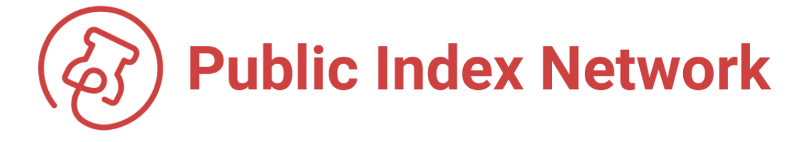

# Welcome to PIN

PIN📌is a proof-of-work cryptocurrency designed to index web3 metadata. PIN also exists as a wrapped token on [Ethereum](https://etherscan.io/token/0xc1f976b91217e240885536af8b63bc8b5269a9be), Binance Smart Chain, and Polygon.


**Looking for FLO? We've re-branded to PIN:** [**FLO Rebrand and Expansion Into Web3**](https://medium.com/public-index-network/upgrading-flo-to-pin-to-build-content-rich-web3-applications-d3b679b8f6ab)


Users and developers can **"pin"** metadata, permanently and immutably storing it on the network for public use. Pins can then be retrieved and read by any PIN-based application. When combined with its supporting metadata library, the [Open Index Protocol \("OIP"\)](https://www.openindexprotocol.com/), **PIN provides a new standard for publishing, indexing, and monetizing any digital content.**

A robust development community is actively using PIN to create and index immutable links that will help to serve as the infrastructure for web3.

 

> "The goal of PIN is to build a worldwide database of metadata for content on the web,"
>
> — **Joseph Fiscella**, CEO of PIN Labs.





