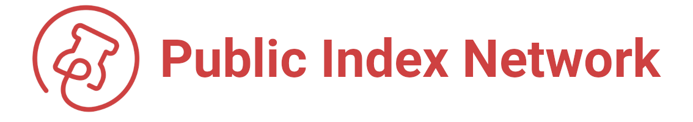

# Welcome to PIN


**Looking for FLO? We've re-branded to PIN:**  [**FLO Rebrand**](https://medium.com/@JosephFiscella/d3b679b8f6ab)


**PIN** is a proof-of-work cryptocurrency designed to save and index metadata to a decentralized, permission less network.

Its unique features can be used to **"pin"** up to 1040 bytes to any transaction and store it permanently and immutably on the network. The pins can then be retrieved and read by many PIN-based applications. When combined with its supporting metadata library, the [Open Index Protocol \("OIP"\)](https://www.openindexprotocol.com/), **PIN provides a new standard for publishing, indexing, and monetizing any digital content.**

A **robust development community** is actively using PIN to create and index immutable links that will help to serve as the infrastructure for web3.

 

> "The goal of PIN is to build a worldwide database of metadata for content on the web,"
>
> — **Joseph Fiscella**, Co-Founder & Lead Developer for PIN \(formerly FLO Network\).



